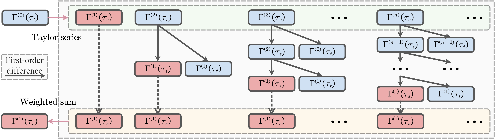
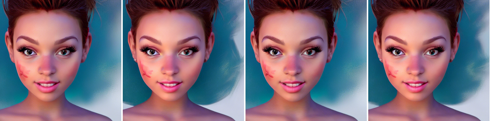
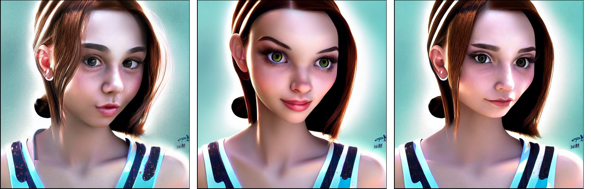
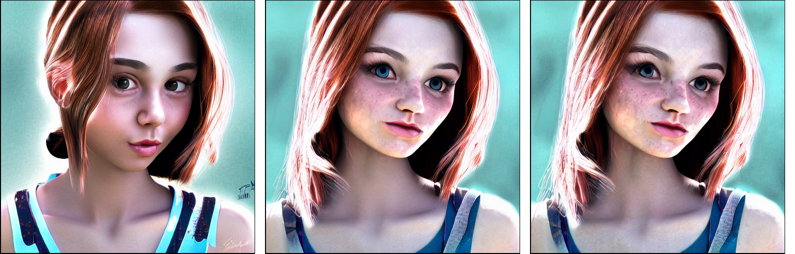
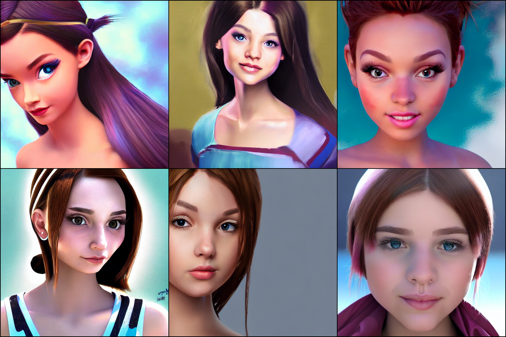

# SciRE-Solver: Accelerating Diffusion Models Sampling  by Score-integrand Solver with Recursive Difference  
[](https://paperswithcode.com/sota/image-generation-on-cifar-10?p=scire-solver-efficient-sampling-of-diffusion)  [](https://paperswithcode.com/sota/image-generation-on-celeba-64x64?p=scire-solver-efficient-sampling-of-diffusion)


Created by [Shigui Li](https://ShiguiLi.github.io/)\*, [Wei Chen](https://scholar.google.com/citations?hl=en&user=n5VpiAMAAAAJ), [Delu Zeng](https://scholar.google.com/citations?user=08RCdoIAAAAJ)

This code is an official demo of PyTorch implementation of SciRE-Solver.


[ArXiv](https://doi.org/10.48550/arXiv.2308.07896)


*The <em>SciRE-Solver</em> is a class of accelerating sampling algorithms tailored for diffusion models, requiring <em>no training and optimization</em>. Its numerical algorithm design is fundamentally predicated on the score-integrand form and the following recursive difference  refinement, a novel  numerical  approach we introduce for improving the integral of the score function networks.*

*The SciRE-Solver is a class of accelerating sampling algorithms tailored for diffusion models, requiring no training and optimization. Its numerical algorithm design is fundamentally predicated on the score-integrand form and the following recursive difference refinement, a novel numerical approach we introduce for improving the integral of the score function networks.*

**(Update 2025.6.27) Existing fast samplers like DPM-Solver rely on signal-to-noise ratio (SNR) transformations, yet suffer from numerical instability near the final denoising steps due to SNR divergence (as $\sigma_t \to 0$). To address this limitation, we propose a novel reformulation based on the Noise-to-Signal Ratio (NSR), which naturally vanishes as time approaches zero, offering improved numerical conditioning.**

<p align="center">
  
</p>


SciRE-Solver encompasses two algorithm types: **SciRE_v1** and **SciRE_v2**, which come with three available iteration modes: **multistep**, **singlestep_agile**, and **singlestep_fixed**. 

**SciRE-Solver, while accelerating, has achieved a better 'FID' compared to the previous achievements of pre-trained models.**


# Test SciRE-Solver on EDM (1.76 FID on CIFAR-10)
- SciRE_v1-2 (singlestep_fixed) with cpkt ([edm-cifar10-32x32-cond-vp.pkl](https://nvlabs-fi-cdn.nvidia.com/edm/pretrained/edm-cifar10-32x32-cond-vp.pkl)) attian $2.29$ FID with $12$ NFE, $2.16$ FID with $14$ NFE, $1.94$ FID with $20$ NFE, $1.79$ FID with $50$ NFE, $1.76$ FID with $100$ NFE, when $\phi_1(m)=\phi_1(3)$.


# [Stable-Diffusion](https://github.com/Stability-AI/StableDiffusion) 
The code is now available in the ['sd_scire'](sd_scire/stable-diffusion/ldm/models/diffusion/scire_solver) folder, and we welcome everyone to use the SciRE-Solver on stable-diffusion. Next, we will integrate the code into the stable-diffusion repository.

Args:
- algorithm_type: 'SciRE_v1' or 'SciRE_v2'
- method: "multistep" or "singlestep_agile" or "singlestep_fixed".

- When using a small number of sampling steps, we recommend using "multistep" method as:
  - "SciRE_v1-2m"
  - "SciRE_v1-3m"
  - "SciRE_v2-2m"
  - "SciRE_v2-3m" (at 6 steps, it is empirically better than other "m" options.)
- When the number of sampling steps '>= 26', we recommend trying all available options that can help produce diversity (single-step with 50 NFE may better, empirically). 

Empirically, SciRE-Solver with the multistep method can generate higher-quality samples in just a few steps and outperforms DPM-Solver++(multistep) in terms of sample quality even after 50 steps. While maintaining high quality, samples generated by SciRE-Solver using  singlestep(and fixed) and multistep methods also display selectable diversity.


Comparison of images by SciRE-Solver with single-step and multi-step, using 50 NFE, and text prompt “a girl face in modern Disney style, physically-based rendering, ultimate painting, UHD”, and seed 33 (scale = 7.5). 
<p align="center">
  
</p>
<p align="center"><strong>The pictures correspond to SciRE_v1_2m, SciRE_v1_2s, SciRE_v2_2m and SciRE_v1_2s in order sequentially.</strong> </p>


Comparison of images generated by SciRE-Solver with single-step and multi-step approaches for this Disney prompt.
<p align="center">
  
</p>
<p align="center"><strong> SciRE_v2_2s, SciRE_v1_3s and SciRE_v2_3s with single-step (pictures sequentially).</strong> </p>

<p align="center">
  
</p>
<p align="center"><strong> SciRE_v2_2m, SciRE_v1_3m and SciRE_v2_3m with multi-step (pictures sequentially).</strong> </p>


Samples by SciRE_V2_3 with singlestep (50 NFE) for this Disney prompt.
<p align="center">
  
</p>
<p align="center"><strong>SciRE_v2_3s with 50 NFE.</strong> </p>


Samples by Stable-Diffusion with SciRE-Solver and DPM-Solver++, using 50 NFE, and text prompt “A beautiful mansion beside a waterfall in the woods, by josef thoma, matte painting, trending on artstation HQ”, and seed 33 (scale = 7.5). 
<p align="center">
  
</p>
<p align="center"><strong>SciRE_v1 with 2m (left) and 3m (right).</strong> </p>
<p align="center">
  
</p>
<p align="center"><strong>SciRE_v2 with 2m (left) and 3m (right).</strong> </p>
<p align="center">
  
</p>
<p align="center"><strong>DPM-Solver++</a> with 2m (left) and 3m (right).</strong></p>


# TODO:

# Update (2025.6.27)
**Our approach is both simple and effective. More importantly, beyond its simplicity, it is a fundamentally original method that requires no post-optimization or re-optimization using pre-generated solutions or trajectories. 
This work was initially met with challenges during the review process, where reviewers requested comparisons with methods that depend on post-optimization or re-optimization using pre-generated trajectories. We believe our approach offers a fundamentally different and valuable contribution to the field.**

**We remain resilient. We welcome the community to try SciRE-Solver and look forward to your feedback and contributions.**
 

# Acknowledgement

Our code is based on [ScoreSDE](https://github.com/yang-song/score_sde) and [DPM-Solver](https://github.com/LuChengTHU/dpm-solver).

# Citation

If you find our work beneficial to you, please consider citing:

```
@article{li2023scireAD,
  title={SciRE-Solver: Accelerating Diffusion Models Sampling  by Score-integrand Solver with Recursive Difference},
  author={Li, Shigui and Chen, Wei and Zeng, Delu},
  journal={arXiv preprint arXiv:2308.07896},
  year={2023}
}
```

